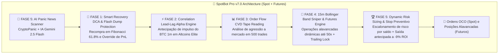

# SpotBot Pro 🤖📈 — Institutional Quantitative AI Engine (v7.0 - HedgeFund Edition)

[](https://www.python.org/)
[](LICENSE)
[](https://www.binance.com/)
[](https://aistudio.google.com/)
[](https://github.com/giovannebotelho/spotbot-pro-hedgefund)

**SpotBot Pro v7.0** é um algoritmo de negociação quantitativa de nível institucional projetado com os pilares da microestrutura de mercado das grandes mesas de Wall Street (**Order Flow CVD Tape Reading, 15m Bollinger Band Sniper, Alavancagem Dinâmica até 50x Isolada, Cointegration Pair Trading, Correlation Lead-Lag Alpha, Smart Recovery DCA em Suportes de Fibonacci, Dynamic Risk Sizing Escalonado e Stop Preventivo Antecipado**), integrado à **Inteligência Artificial Generativa do Google Gemini (SDK `google-genai`)** e com **suporte completo para o Mercado de Futuros (Binance USDS-M Futures)**.

---

## 🏛️ Arquitetura Quantitativa v7.0



---

## 🚀 Armas Quantitativas da Versão v7.0

### 1. 🧪 Smart Recovery DCA em Suportes de Fibonacci
- **Proteção Contra Pavios**: Em *flash dumps* causados por liquidações de derivativos na Binance, o robô efetua uma única recompra de 50% no Suporte Institucional de Fibonacci (61.8% / 78.6%).
- **Recuperação de PM**: Puxa o Preço Médio ($PM$) para baixo e re-posiciona a ordem OCO com Take Profit em apenas **+0.8% acima do novo $PM$**, garantindo saída no lucro no primeiro repique!

### 2. ⚡ Correlation Lead-Lag Alpha Engine (Motor de Antecipação BTC/ETH)
- **Arbitragem Temporal**: Detecta quando o `BTCUSDT` sofre um surto de volume e preço ($\ge +0.25\%$ em 3m) no gráfico de 1 minuto.
- **Entrada Antecipada**: Entra na altcoin do Top 40 que ainda está em atraso estatístico (*Lag*) **antes** que o movimento se espalhe, alocando multiplicador **1.5x**.

### 3. 📊 Order Flow Cumulative Volume Delta (CVD Tape Reading)
- **Leitura de Agressão**: Analisa as últimas 500 negociações executadas a mercado (*Market Orders*) na Binance Spot.
- **Confirmador de Volume**: Dispara compras quando a agressão compradora atinge $\ge 60\%$ e **dobra o lote (2.0x)** se o delta acumulado ultrapassar **+$50.000 USDT**.

### 4. ⚙️ Alavancagem Dinâmica & Dynamic Risk Sizing
- **Dimensionamento Escalonado por Banca**: Adapta o risco por trade automaticamente conforme o saldo total (8% para bancas $\le \$200$, 5% até $\$1.000$, 3% até $\$3.000$ e 2% institucional acima de $\$3.000$).
- **Alavancagem Sob Medida**: Calcula a alavancagem exata $\text{Alavancagem} = \frac{1}{\text{Stop Loss \%} \times 2.0}$ (travada entre 1x e 50x) para cobrir a margem necessária com risco controlado.

### 5. 🛡️ Trailing Lock Dinâmico & Stop Preventivo
- **Take-Profit Máximo (+5.5% ROI)**: Fecha a mercado imediatamente ao bater a meta de lucro rápido.
- **Trailing de Retração**: Ao atingir pico de $+3.0\%$ de ROI, garante o lucro protegendo recuos de $3\%$.
- **Stop Preventivo (-9.0% ROI)**: Encerra posições negativas a mercado antes que alcancem o Stop Loss rígido, reduzindo perdas pela metade.

### 6. 🪙 Cesta de Ativos Top 6 Elite
- **Seleção Focada**: Opera exclusivamente nos pares de maior consistência técnica e liquidez institucional: `BTCUSDT`, `ETHUSDT`, `SOLUSDT`, `BNBUSDT`, `XRPUSDT` e `LINKUSDT`.

---


## 📱 Bot Telegram & Interface Web Dashboard

- 🖥️ **Dashboard Web Profissional (NiceGUI & Plotly)**:
  - Gráficos K-Line interativos em tempo real com suporte a múltiplos timeframes.
  - Ticker bar contínuo, cards de métricas em tempo real e botão de emergência **CANCEL (CTRL+C)**.
- 📱 **Comandos Telegram Interativos**:
  - `/status`: Exibe o ativo em foco, RSI, tendência e **Confluência MTF Score (4H+1H+15M)**.
  - `/noticias` ou `/sentimento`: Exibe a classificação de pânico e notícias via **IA Gemini 2.5 Flash**.
  - `/ocos` ou `/ordens`: Exibe os valores exatos de Take Profit, Stop Loss e posições ativas.
  - `/saldo`: Saldos USDT, BNB e cálculo do **Lote Máximo do Critério de Kelly**.
  - `/top40` ou `/scanner`: Varre o Rank de Força Relativa (RS vs BTC) dos 40 maiores criptoativos.
  - `/lucro` ou `/perf`: Lucro líquido acumulado e Win Rate acumulado do banco SQLite.
  - `/relatorio` ou `/pdf`: Gera e envia o **Relatório Executivo em PDF** no Telegram.

---

## ⚙️ Variáveis de Ambiente (`.env`)

Configure o arquivo `.env` na raiz do projeto:

```env
# --- Configuração do Ambiente ---
BOT_ENVIRONMENT=mainnet

# --- Chaves Binance (Spot API) ---
mainnet_api_key=SUA_CHAVE_API_BINANCE
mainnet_secret_key=SEU_SECRET_KEY_BINANCE

# --- Google Gemini IA ---
gemini_api=SUA_CHAVE_API_GEMINI

# --- Telegram Bot ---
bot_token=SEU_TOKEN_TELEGRAM_BOT
chat_id=SEU_CHAT_ID_TELEGRAM

# --- Dashboard Web NiceGUI ---
DASHBOARD_USER=admin
DASHBOARD_PASSWORD=admin123
SECRET_KEY=spotbot_secured_key_8823
```

---

## 📂 Estrutura Modular do Repositório

```text
spotbot/
│
├── config/                  # Configurações centralizadas e resolução de variáveis .env
│   └── settings.py
├── core/                    # Núcleo quantitativo de trading v5.0
│   ├── engine.py            # Loop principal assíncrono, Telegram Bot & OCO Lifecycle
│   ├── decision.py          # SMC, Whale Walls, ATR, Lead-Lag Alpha, Stat-Arb & Kelly Sizing
│   ├── indicators.py        # MTF Matrix, Fibonacci Supports, CVD, Z-Score, ATR, RSI, MACD
│   ├── patterns.py          # Reconhecimento de padrões de velas (Candlesticks)
│   └── post_trade.py        # Processamento de ordens e estatísticas
├── services/                # Serviços e Integrações
│   ├── binance_client.py    # Cliente assíncrono Binance (Spot & Futures API)
│   ├── database.py          # Gerenciador de Banco de Dados SQLite
│   ├── gemini_ai.py         # Classificador de Sentimento e Pânico Noticioso via IA Gemini
│   ├── news_scanner.py      # Coletor de manchetes em tempo real (CryptoPanic API)
│   ├── pdf_generator.py     # Gerador de Relatório Semanal em PDF ReportLab
│   └── telegram_notifier.py # Notificador e manipulador Telegram
├── ui/                      # Interface Web NiceGUI
│   └── dashboard.py         # Terminal Web Institucional NiceGUI
├── scratch/                 # Scripts de Teste e Validação Quantitativa
│   ├── test_smart_recovery_dca.py
│   ├── test_lead_lag_alpha.py
│   ├── test_order_flow_cvd.py
│   ├── test_stat_arb_pairs.py
│   └── test_kelly_sizing.py
├── requirements.txt         # Dependências do projeto Python
└── run.py                   # Ponto de entrada unificado
```

---

## 🚀 Como Executar Localmente

```powershell
# 1. Clonar o repositório
git clone https://github.com/giovannebotelho/spotbot-pro-hedgefund.git
cd spotbot-pro-hedgefund

# 2. Ativar o ambiente virtual e instalar dependências
.\env_spotbot\Scripts\activate
pip install -r requirements.txt

# 3. Executar o Dashboard Web e Robô SpotBot Pro v7.0
python run.py --mode dashboard
```

Acesse a interface gráfica no navegador em **`http://localhost:8080`**.

---

## 📄 Licença

Este projeto está licenciado sob a licença [MIT](LICENSE).
